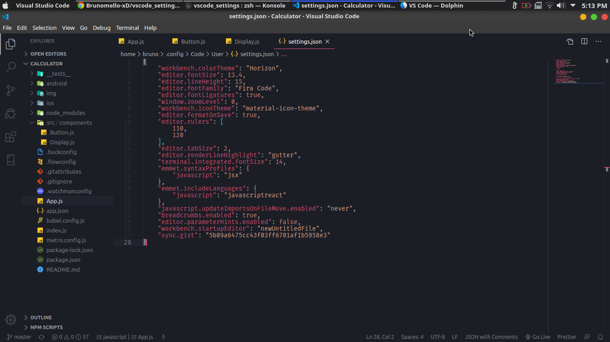

<h1>Visual Studio Code</h1>
<h2>Pré-requisitos:</h2>
<ul>
  <li><a href="https://marketplace.visualstudio.com/items?itemName=jolaleye.horizon-theme-vscode" target="_blank" >Horizon    Theme</a></li>
  <li><a href="https://marketplace.visualstudio.com/items?itemName=PKief.material-icon-theme" target="_blank">Material Icon Theme</a></li>
  <li><a href="https://github.com/tonsky/FiraCode" target="_blank" >FiraCode</a></li>
</ul>

<h2>Instalação:</h2>
<ul>
  <li><b>Windows:</b></li> <var>%APPDATA%\Code\User\settings.json</var>
  <li><b>macOS:</b></li> <var>$HOME/Library/Application Support/Code/User/settings.json</var>
  <li><b>Linux:</b></li> <var>$HOME/.config/Code/User/settings.json</var>
<ul>
